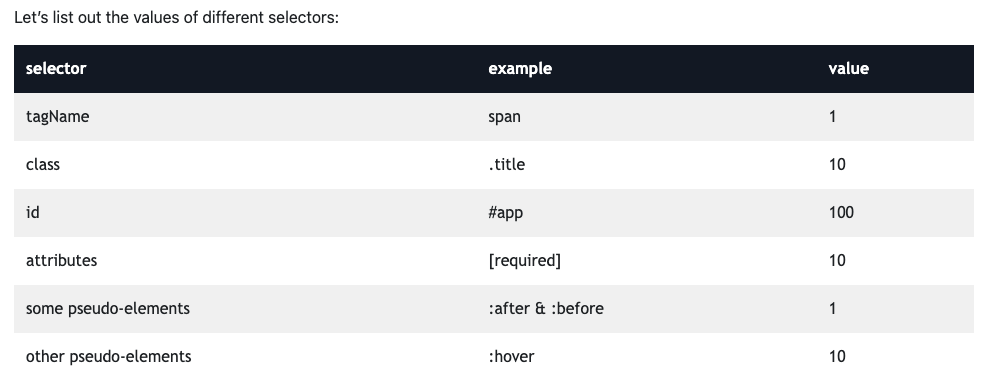

# CSS

# CSS tips 

* Helpful Insights 
  + Using alt and selecting within text fields allows multiple edits
  + Adding a title attribute adds a hover options for details on element
  + Adding id to the href will link to the section of the page
  + Media quries allow you to specify screen sizes (helpful for mobile)
  + min-width at least that size , max-width at most that size 

Utility Tags - designed for nich scenarios
ex: adding padding, margin, etc

CSS Specificity
one rule to rule them all
Determines which rule should be applied in the chance that multiple rules are targeting both the same element and property on that element, but assigning different values.

