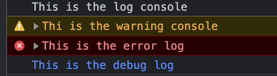
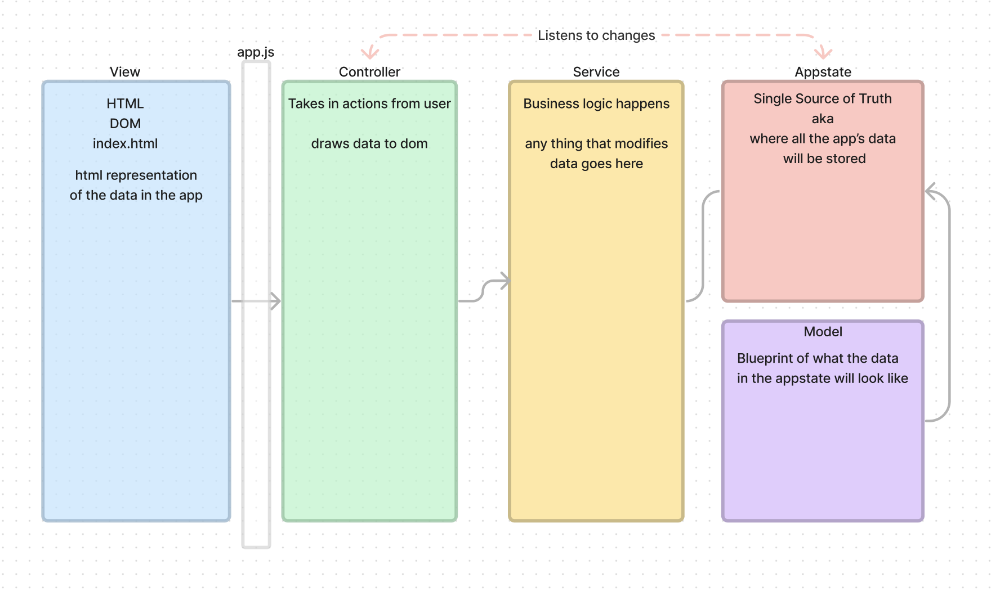

# MVC

MODEL :

- View: HTML , DOM, index.html, -> HTML representation of the data in the app
- Controller : Take in actions from user , draws data to dom
- Service : Business logic happens here, Anything that modifies the data
- AppState : Single soError loading webview: Error: Could not register service workers: InvalidStateError: Failed to register a ServiceWorker: The document is in an invalid state.urce of truth or where data is stored
- MODEL : blueprint of what the data in the appstate will look like

---

-- Classes should be upper cases naming to indicate blueprint over object built out.

-- Every Class has a structure
-- Controllers constructors runs on page load
-- Need to look into constructor
--

--- Service

=== Recommended approach from teach

- Start with the model
- Services and controllers need to plural to help with readability. Models are usually the singular one instance 

- Getter method used to get values from the model 
- MODEL IE Representation 

-- Other logs methods
Console.log , console.warn. console.debug, console.error

-- Other insight 

- Writer functions (provided in util class)

+ Use log for index side  / model 
+ Use warn to indicate controller 
+ use error to indicate service layer 
  

+ MVC design pattern teach these key principles: 
    + Avoid shared mutable state. “Nondeterminism = parallel processing + mutable state” — Martin Odersky, designer of the Scala programming language
“Program to an interface, not an implementation.” — Gang of Four, “Design Patterns: Elements of Reusable Object Oriented Software”
“A small change in requirements should necessitate a correspondingly small change in the software.” — N. D. Birrell, M. A. Ould, “A Practical Handbook for Software Development”